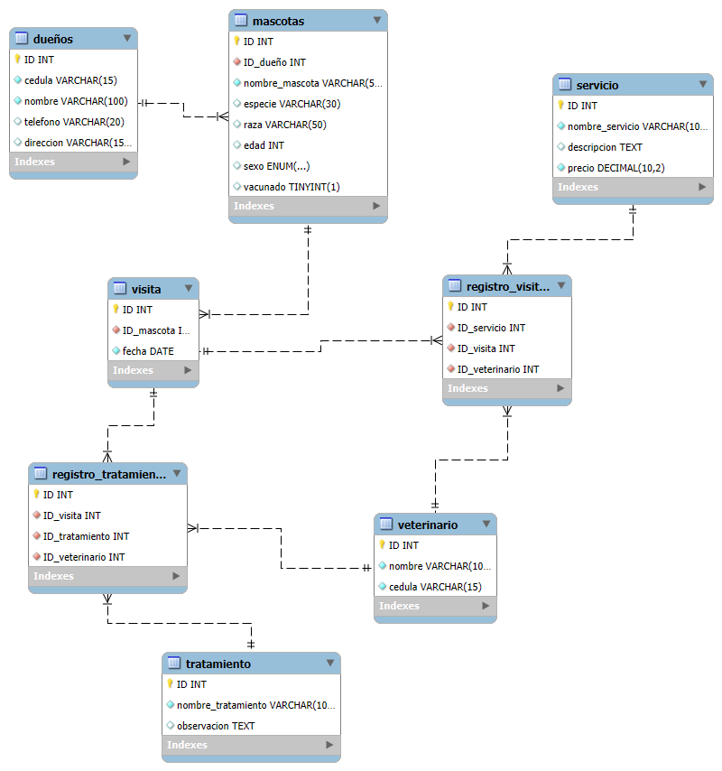

# 🐾 Veterinaria "Mi Mejor Amigo" – Modelo de Base de Datos

Este repositorio contiene el diseño y desarrollo del modelo de base de datos para la veterinaria **"Mi Mejor Amigo"**, el cual permite gestionar información sobre dueños, mascotas, servicios, tratamientos, visitas y veterinarios.

---

## 📁 Contenido del Proyecto

- `ddl.sql` → Archivo de creación de las tablas (estructura del modelo relacional)
- `datos.sql` → Archivo con datos de prueba insertados en las tablas
- `dql.sql` → Archivo con 15 consultas SQL (subconsultas, funciones, joins, alias, etc.)
- `diagrama-uml-er.png` → Diagrama UML entidad-relación del modelo

---

## 💻 Tecnologías Utilizadas

- **MySQL Workbench** – Diseño visual y modelado E-R
- **MySQL** – Creación y gestión del modelo relacional
- **Lenguaje SQL** – DDL, DML y DQL

---

## 📈 Diagrama UML E-R

> A continuación se muestra el diagrama entidad-relación del modelo de datos:

---

## ✍️ Diseño y Descripción del Proceso

### 1. Análisis de Requerimientos

Se revisaron los requerimientos funcionales de la veterinaria “Mi Mejor Amigo”, donde se identificaron las entidades principales: dueños, mascotas, servicios, visitas, tratamientos y veterinarios. También se determinaron relaciones clave como:

- Un dueño puede tener varias mascotas.
- Cada mascota puede tener varias visitas.
- En una visita se puede aplicar un servicio y múltiples tratamientos.
- Cada tratamiento o servicio es atendido por un veterinario específico.

### 2. Diseño del Modelo E-R (UML)

Se diseñó el modelo entidad-relación utilizando MySQL Workbench. El modelo incluye:

- Entidades principales: `dueños`, `mascotas`, `servicio`, `visita`, `tratamiento`, `veterinario`
- Tablas puente:
  - `registro_visitas` (relaciona visitas, servicios y veterinarios)
  - `registro_tratamiento` (relaciona tratamientos con visitas y veterinarios)
- Relaciones 1:N y N:M implementadas mediante llaves foráneas

### 3. Creación del Modelo Relacional (DDL)

El modelo se implementó en SQL, definiendo:

- Llaves primarias (`PRIMARY KEY`)
- Llaves foráneas (`FOREIGN KEY`)
- Tipos de datos: `INT`, `VARCHAR`, `TEXT`, `DATE`, `DECIMAL`, `ENUM`, `BOOLEAN`
- Integridad referencial entre tablas

### 4. Población de Datos (DML)

Se poblaron las tablas con datos de ejemplo:

- 5 dueños
- 10 mascotas
- 5 servicios
- 10 visitas
- 5 tratamientos
- 3 veterinarios
- Se enlazaron correctamente las visitas, tratamientos y servicios mediante las tablas intermedias

### 5. Consultas SQL (DQL)

Se desarrollaron 15 consultas que utilizan:

- Subconsultas anidadas
- Funciones de texto y agregación
- Alias (`AS`)
- Joins entre múltiples tablas
- Tablas creadas desde subconsultas (`CREATE TABLE AS`)
- Condicionales en consultas con `IF`

---

## 🎥 Video Explicativo

> Enlace al video explicando el modelo E-R y la implementación en SQL:

📎 [Video explicativo aquí](https://enlace-a-tu-video.com)

---

## 📌 Autores

| Nombre del Integrante | GitHub |
|---|---|---|
| Sergio Lievano | [@sergiosteven66](https://github.com/sergiosteven66)|
| Bryan Villabona | [@BryanVillabona](https://github.com/BryanVillabona)|

---
